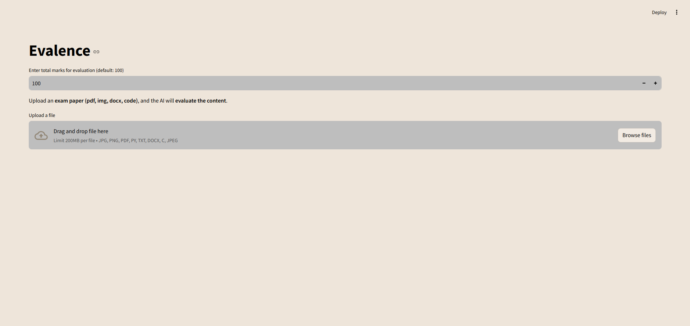
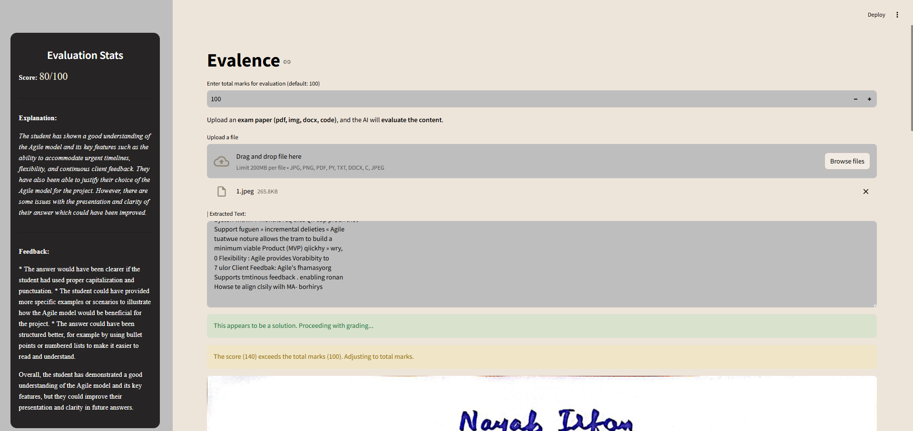

# Evalence - AI Exam Grading System

## Overview
Evalence is an AI-powered **automated exam grading system** that can analyze and evaluate **text, images, PDFs, DOCX files, code snippets, and graphs**. The system extracts content from uploaded documents, determines their nature (questions, solutions, reports, etc.), and provides **automated grading with feedback.**

## Features
- **Extracts text** from images, scanned PDFs, Word documents, and handwritten content.
- **AI-driven grading** with **automated evaluation and scoring**.
- **Handles images separately** – evaluates graphs, diagrams, and tables using AI.
- **Supports multiple content types** – PDFs, DOCX, images, text, and programming code.
- **Distinguishes content type** – recognizes if the uploaded content is a **question, solution, or report**.
- **Prevents score exceeding total marks**.
- **Provides structured feedback** to enhance student performance.
- **Modern and aesthetic UI** with Streamlit.

## Tech Stack
- **Python 3.12.5**
- **Streamlit** – for UI and user interaction
- **OCR (PyTesseract, PyMuPDF, python-docx)** – for extracting text from images and documents
- **Transformers (DeepSeek, Mixtral, Azure AI Vision)** – for AI-based evaluation
- **Requests** – for API interactions
- **Pillow** – for image processing

## Installation
### Clone the Repository
```bash
git clone https://github.com/vinabi/evalence.git
cd evalence
```

### Install Dependencies
```bash
pip install -r requirements.txt
```

### Set Up API Keys
Create a `.env` file and add your API keys:
```
GROQ_API_KEY=your_groq_api_key
AZURE_VISION_API_KEY=your_azure_api_key
AZURE_VISION_ENDPOINT=your_azure_endpoint
```

### Run the Application
```bash
streamlit run app.py
```

## 📂 Project Structure
```
📦 Evalence
├── app.py                 # Main Streamlit app
├── grading.py             # AI grading logic
├── vision.py              # Image and graph analysis
├── ocr.py                 # Text extraction from PDFs and images
├── code_grader.py         # Code evaluation
├── requirements.txt       # Required Python dependencies
├── .env                   # API keys (ignored in Git)
├── interface              #images
└── README.md              # you're literally reading it
```

## Usage Guide
### Uploading a File
1. Open the app (`streamlit run app.py`).
2. Click **Browse files** to upload a **PDF, image, DOCX, or code file**.
3. The AI extracts and displays text in real time.
4. If the content is a **solution**, the AI **grades and provides feedback**.
5. If it’s **not a solution**, the AI explains its nature.

### Supported File Types
**Images:** JPG, PNG, JPEG
**Documents:** PDF, DOCX
**Code Files:** PY, TXT, C

## Example Screenshots

### File Upload Interface


### Extracted Text & AI Evaluation


## Challenges & Solutions
### Challenge: Handling Multiple Content Types
**Solution:** Developed a classification system to **identify content** before grading.

### Challenge: Evaluating Images (Graphs, Handwriting)
**Solution:** Integrated **Azure AI Vision API** for structured **graph analysis** and OCR-based handwriting recognition.

### Challenge: Preventing AI Score from Exceeding Total Marks
**Solution:** Implemented **validation logic** to cap scores at total marks set by the user.

## Future Improvements
- **Better Graph Evaluation** – Enhance AI’s ability to interpret complex diagrams.
- **Multilingual Support** – Expand to handle multiple languages in handwritten and typed text.
- **Faster Processing** – Optimize OCR and AI API calls for real-time grading.
- **Enhanced UI** – Improve accessibility and UX with better visualization.

## Contributing
Contributions are welcome! If you find a bug or want to suggest a feature:
1. **Fork the repo**
2. **Create a branch** (`feature-new-improvement`)
3. **Submit a pull request**

## License
This project is licensed under the **MIT License**.

---

#### If you find this project helpful, don’t forget to star the repo! 🎀
